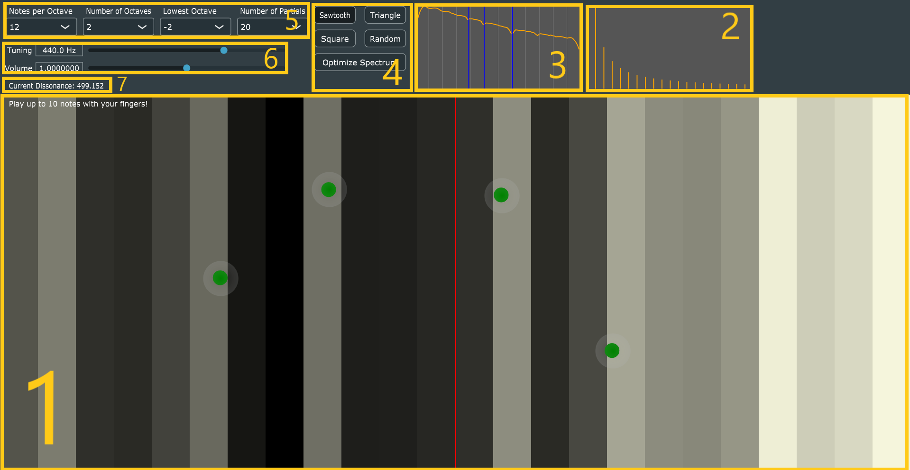

#  Multi-Touch-Instrument ("Shades of Grey")

This is a prototype of a polyphonic multi-touch instrument with a freely adjustable tone scale. The "keyboard" provides visual feedback regarding the consonance/dissonance of chords in the form of a greyscale.

## Demo video

## How to build the app

For compiling the application you need the [JUCE framework](https://juce.com), a C++ environment and an IDE.  
You can also find an executable for Windows under "Releases".

## Maintainer

- [Hannes Bradl](mailto:hbradl@student.tugraz.at)

